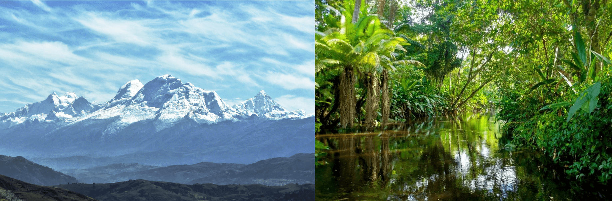

.. OSGeo Challenge 2021 documentation master file, created by
   sphinx-quickstart on Fri Aug 13 15:31:17 2021.
   You can adapt this file completely to your liking, but it should at least
   contain the root `toctree` directive.

###############################################################################################################################
Material for 2021 UN Open GIS Challenge 1 - Training on Satellite Data Analysis and Machine Learning with QGIS (Satellite_QGIS)
###############################################################################################################################

***********************************************************************************************************
Title: Machine Learning with Earth Observation data: Case studies with Semantic Segmentation and Regression
***********************************************************************************************************

This is part of `OSGeo Challenge 2021 <https://www.osgeo.org/foundation-news/2021-osgeo-un-committee-educational-challenge/>`_

This educational material is based on two exercises related to the areas of Semantic Segmentation for Change Detection and Regression of times series. 
At the end of this tutorial the users will be able to: download, pre-process, clip and mosaic satellite images of different dates from a certain region of interest, 
create a dataset for supervised machine learning, perform semantic segmentation and regression with sequences of multitemporal images, highlight, 
measure and quantify changes in images from different dates, and analyze the NDVI values of a region based on historical data from the last years.

This tutorial was fully tested using the QGIS version 3.16.10 (current Long Term Release - LTR), with OS: Windows (8 and 10), macOS (Big Surf 11.5.2), and Linux (Ubuntu 18.04). 
It might work in other QGIS versions; however, it has not been fully tested in other versions.

For Exercise 1, the `Semi-Automatic Classification Plugin (SCP) 7.9.7 <https://fromgistors.blogspot.com/p/semi-automatic-classification-plugin.html>`_ and `Dzetsaka 3.70 <https://github.com/nkarasiak/dzetsaka>`_ plugins were employed.

For Exercise 2, the `GEE Timeseries Explorer 1.1 <https://geetimeseriesexplorer.readthedocs.io/en/latest/>`_ and `Google Earth Engine <https://gee-community.github.io/qgis-earthengine-plugin/>`_ were used.

Exercise 1
==========

.. toctree::
   :caption: Supervised Change Detection: Monitoring deglaciation in Huascaran, Peru
   :numbered:
   :maxdepth: 2

   exercise-1-change-detection/01_introduction
   exercise-1-change-detection/02_supervised-change-detection
   exercise-1-change-detection/03_general-configuration
   exercise-1-change-detection/04_download-landsat-images
   exercise-1-change-detection/05_dataset-preparation
   exercise-1-change-detection/06_collect-samples-train-test
   exercise-1-change-detection/07_semantic-segmentation
   exercise-1-change-detection/08_change-detection
   exercise-1-change-detection/09_concluding-remarks

.. toctree::
   exercise-1-change-detection/10_appendix_A
   exercise-1-change-detection/11_appendix_B

Exercise 2
==========

.. toctree:: 
   :caption: Regression over Google Earth Engine Time Series
   :numbered:
   :maxdepth: 2

   exercise-2-regression/01_introduction
   exercise-2-regression/02_regression
   exercise-2-regression/03_general-configuration
   exercise-2-regression/04_gee-elements
   exercise-2-regression/05_data-pyqgis-gee
   exercise-2-regression/06_linear-regression
   exercise-2-regression/07_analyzing-results
   exercise-2-regression/08_concluding-remarks

.. toctree::
   exercise-2-regression/09_appendix_A

.. Indices and tables
.. ==================

.. * :ref:`genindex`
.. * :ref:`modindex`
.. * :ref:`search`

Author
======

`Patrick Happ <https://www.linkedin.com/in/patrick-nigri-happ-44533710b/>`_

Mentors
=======

- `Maria A. Brovelli (Politecnico di Milano) <https://www4.ceda.polimi.it/manifesti/manifesti/controller/ricerche/RicercaPerDocentiPublic.do?evn_didattica=evento&k_doc=1262&aa=2019&lang=EN&jaf_currentWFID=main>`_
- `Cristina Vrinceanu (University of Nottingham) <https://www.nottingham.ac.uk/ngi/meet-the-team/cristina.vrinceanu>`_
- `Cung Thang (UN) <https://www.linkedin.com/in/cthang>`_
- `Zhongxin Chen (UN FAO) <https://twitter.com/chzhxchen>`_

Acknowledgements
================

To `Pedro Diaz <https://www.linkedin.com/in/pedro9589/>`_ and `Jorge Paredes <https://www.linkedin.com/in/jsparedes/>`_, for their help to test both exercises in different OS, and to perform a general review of this educational material.